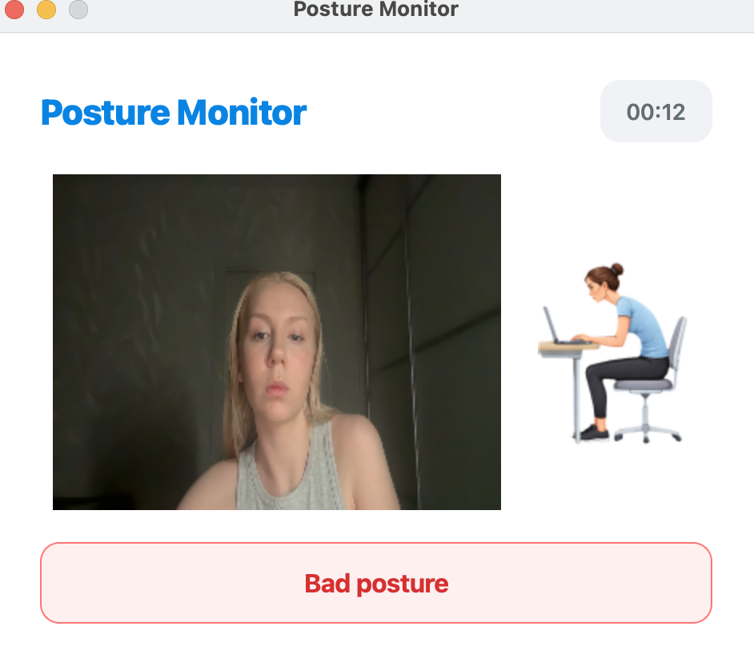

# PostureApp

PostureApp is a macOS application that tracks user posture in real time using MediaPipe and computer vision.  
It helps build healthy sitting habits and reduces strain on the back during work or study.

---

## 📸 Screenshots

| Main Screen | Good Posture | Bad Posture |
|------------|------------|-----------|
|  |  |  |
|  |  | |

---

## 🚀 How to Run with Docker

```bash
docker build -t postureapp .
docker run -it --rm postureapp
```

### 🛠 Technologies

Python

MediaPipe

OpenCV

PySide6

Docker

### 🤝 License

MIT License
